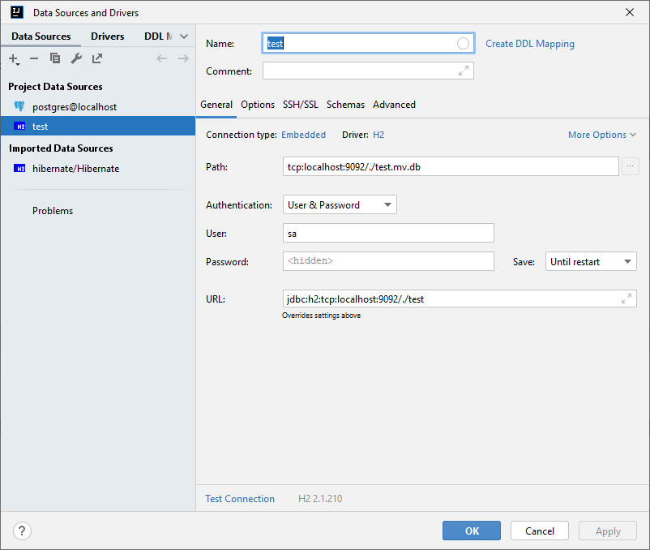

# CREATE H2 DATABASE
C:\TAF\jdk-17.0.2+8\bin\java.exe -cp C:\TAF\.m2\repository\com\h2database\h2\2.2.224\h2-2.2.224.jar org.h2.tools.Shell  
url = jdbc:h2:./test  (pour la créer dans le projet)     
user = SA  
password = "vide"  
"quit" à la fin  

# START H2 DATABASE
C:\TAF\jdk-17.0.2+8\bin\java.exe -cp C:\TAF\.m2\repository\com\h2database\h2\2.2.224\h2-2.2.224.jar org.h2.tools.Server -tcp -baseDir .

# CONNECT INTELLIJ

 
url = jdbc:h2:tcp:localhost:9092/./test   
(path = tcp:localhost:9092/./test.mv.db)  

# CREATE POSTGRES DATABASE
cd D:\TAF\pgsql\bin
initdb.exe -D D:\TAF\pgsql\data
pg_ctl -D ^"D^:^\TAF^\pgsql^\data^" -l fichier_de_trace start

# START POSTGRES DATABASE
.\pg_ctl.exe -D "D:\TAF\pgsql\data" -l fichier_de_trace start
